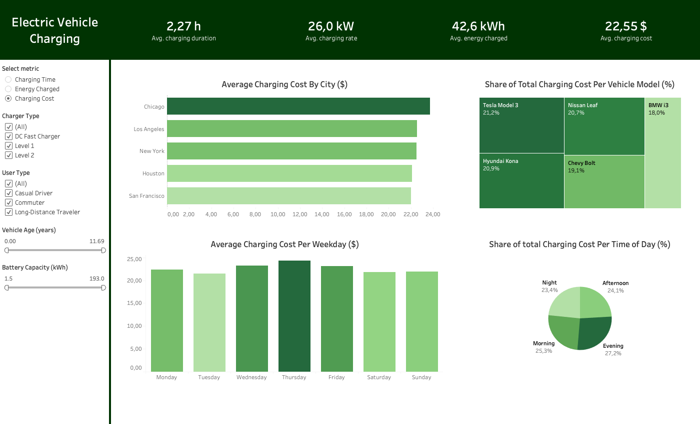
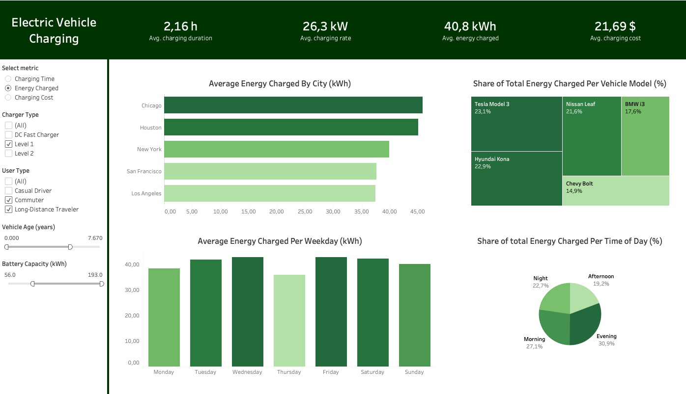

# Electric Vehicle Charging Patterns - Tableau Dashboard

## Summary
In this project, a Tableau dashboard is created to understand and visualize charging patterns for electrical vehicles. The dashboard has been made dynamic so the user can toggle between different metrics as well as filter the data based on several parameters.

The dashboard contains summarizing statistics as well as visualizations and graphs.

 

## Resources used
**Tableau Desktop - Public Edition:** 2024.2.3

## Data
The project has been conducted using a dataset containing data on 1320 charging sessions for electric vehicles in different cities in the United States.
It is available on Kaggle [here]([https://www.kaggle.com/datasets/valakhorasani/electric-vehicle-charging-patterns/data]).
The dataset includes 20 columns with information about each of the charging sessions.

## The Dashboard
You can accesss the dashboard through the .twbx file in this repositroy. 

Example image of the dashboard in use is displayed below

 
